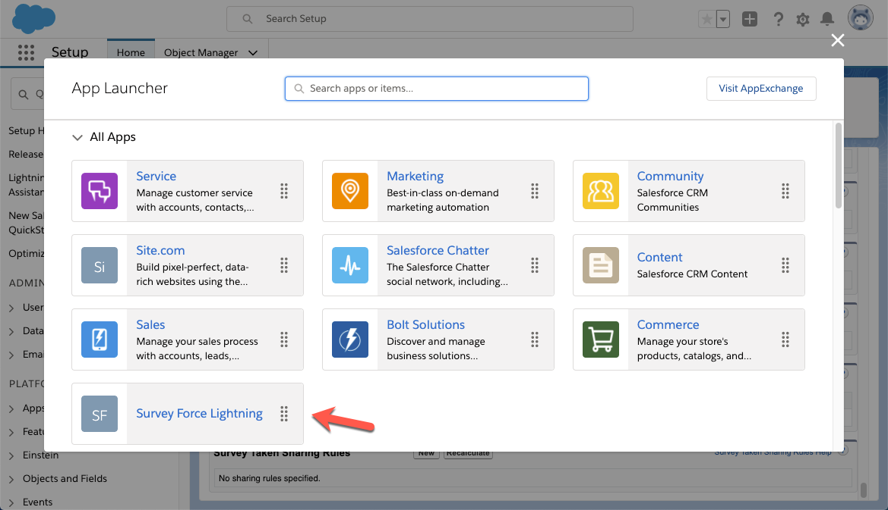
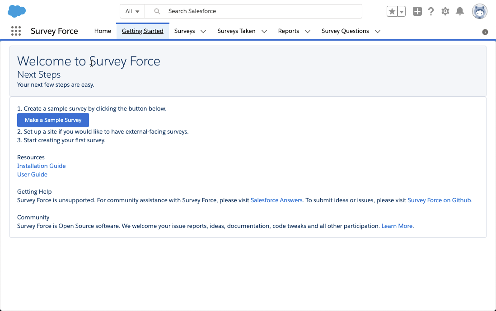

# Post Install Guide - Public Facing Surveys

## General Surveys

1. Go to "Survey Force App"

1. Open "Getting Started" page

1. CLick "Make a Sample Survey"
1. Click "View Sample Survey"

You should be able to see survey, add questions, edit CSS, share survey with users and see results. Test this survey by sending it to users. In case of errors, check user permissions to appropriate survey objects. There are 4 Survey objets that you need to check.

Make sure that you check access for Force.com site guest user if you plan to embed this survey in Force.com site.

- Survey
- Survey Question Response
- Survey Taken
- Survey Question

## Surveys in Force.com sites

1. Create a Force.com Site. [Details, including "Creating a Force.com Site"](http://wiki.developerforce.com/page/An_Introduction_to_Force.com_Sites)
1. Modify your Site's ["Public Access Settings"](https://login.salesforce.com/help/doc/en/sites_public_access_settings.htm)
1. Check "Read" access to "Survey" and "Survey Question" object.
1. Check "Read" and "Create" access for "Surveys Taken" and "Survey Question Responses"
1. Check "Read" and "Create" access for "Surveys Taken" and "Survey Question Responses"
1. Add the Visualforce page, "Take Survey" to the list of enabled Visualforce pages.

## Survey Connecting to Contact or Case Records

1. Complete "General Surveys" steps.
1. Check "Read" access for "Contact" object.
1. Check "Read" access for "Case" object.
1. Private OWD for Case and Contact ?
     i. Create a public group and add the survey site user. 
     i. Grant read access to case and contact to this group by creating 2 sharing rules
 [Check this thread for further information.](http://boards.developerforce.com/t5/Force-com-Labs-Development-and/Survey-Force-Question/m-p/407457#M1197)

 ## Extra Notes
 Following notes were posted by "Cynthia Chen" on https://appexchange.salesforce.com/listingDetail?listingId=a0N30000003I2gDEAS&revId=a0S3A00000Jk9SvUAJ&tab=r

 1. Error on viewing the report results of the survey: error messages "The report ID and the developer name are not defined. Provide either the report ID or the developer name for the report that contains the chart." and "List has no rows for assignment to SObject"
- It is because the user has no permission to see the report "Survey with Questions and Responses“, just share the report folder to the user will solve this error. If want to share this report to all internal users, create a Public Group and add All Internal Users will be OK. (Enable automatic access to records using role hierarchies for public groups by selecting Grant Access Using Hierarchies when creating the group. However, don’t use this option if you’re creating a public group with All Internal Users as members.)(The all internal user group is created only after portals/community are enabled.)

2. If want put image in the survey title and bottom and let the survey taker see the iamges,
- Sites > SurveyForcePublicSite > Public Access Settings > Field-Level Security > look for the survey object > view > give reading permissions to the header： Survey Header

3. "Secure guest user record access": Enabling this will stop Guest user access to Salesforce org data. Enabling this may result in Guest user not having access to Survey Force records. More details are at: https://help.salesforce.com/articleView?id=networks_secure_guest_user_sharing.htm&type=5. Be careful when enabling this feature.
- You may need to give following access to objects in "Site Guest User Profile" for it to work. Make sure you understand what is involved BEFORE giving this access as this opens up complete access to some record data (which may defeat the purpose of this restriction)
-- IMPORTANT: Latest version of Survey Force app has these permissions enabled by defauly on "Survey Force - Guest" permission set
-- Surveys: Read, View All (Because Guest user need to see an existing record)
-- Survey Questions: Read, View All, Modify All (Because Guest user need to see and modify an existing record)
-- Survey Question Responses: Read, Create  (Because Guest user need to create a new record but does NOT need access to existing record)
-- Surveys Taken: Read, View All, Modify All (Because Guest user need to see and modify an existing record))

4. FUTURE: "Secure guest user record access": In future we will not be able to assign View/Modify All to Guest users. Following is the solution around this:
- Create trigger on Survey__c to assign a newly created survey to Guest User
-- Once Guest user owns that record, they should be able to view/update it at will
-- BE CAREFUL, if a Guest user owns a record then they can make changes as needed. So make sure to only allow Read Only access to Survey and Survey Questions objects
- Create sharing rules to open this record for internal users
